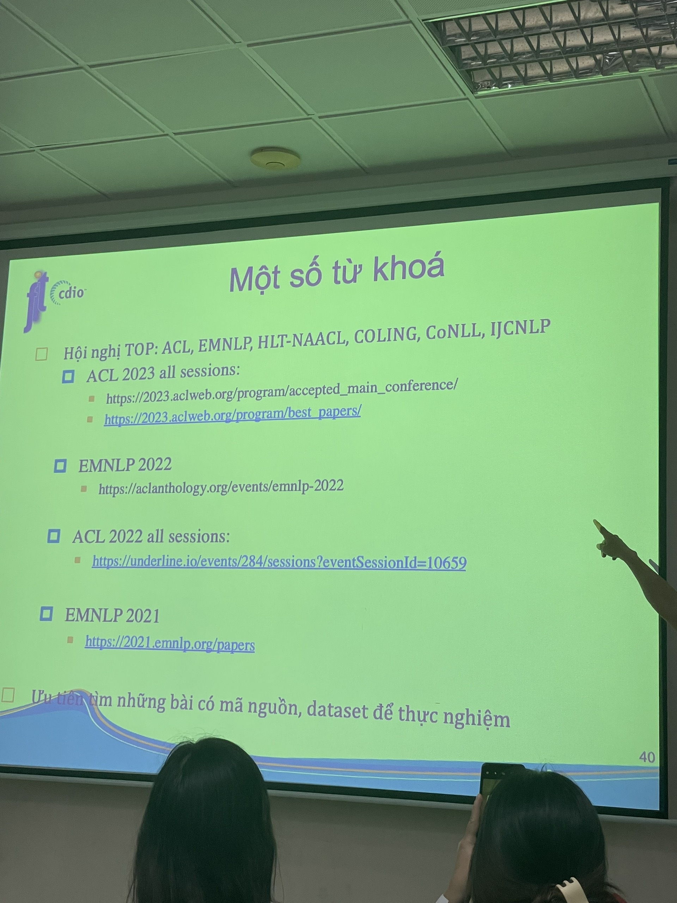

# Khai thác ngữ liệu văn bản

## 20/07/2023
### Giới thiệu - Tổng quan
Phân loại dữ liệu:
- Có cấu trúc (structured data): thông tin đã chọn lọc và lưu dưới dạng cấu trúc
    - có thể thể hiện dạng rational database
    - sẵn sàng để khai thác
    - có thể dùng các thuật toán data mining
- Không có cấu trúc (unstructured data): thông tin trình bày dạng tự nhiên, không theo chuẩn mực, định dạng không nhất quán
    - không thể thể hiện dạng rational database
    - chưa sẵn sàng để khai thác
    - ví dụ: các comment trên một trang web, các dữ liệu đa phương tiện (image, video, audio, file, emails,spreadsheets..)

Dữ liệu văn bản:
- hình thức trao đổi phổ biến nhất
- đặc điểm: không có cấu trúc trình bày cụ thể
- làm thế nào để khai thác thông tin hữu ích trong lượng dữ liệu khổng lồ này? $\rightarrow$ khai thác văn bản = text-mining/text-analytics

Khai thác văn bản:
- quá trình phát hiện tri thức ẩn trong văn bản
- không phải là khai thác dữ liệu (phát hiện tri thức có cấu trúc)
- đây là bước trước bước khai thác dữ liệu

Ứng dụng của khai thác văn bản
- sentiment analysis / opinion mining
- early warning outbreak / outbreak detection (phát hiện sớm dịch bệnh)
- social listening
    - đo lường sức khoẻ thương hiệu
    - xử lý khủng hoảng truyền thông
    - thăm dò đối thủ cạnh tranh
- fake news detection
- fraud detection
- chatbot & 

Kiến trúc chung của một hệ thống khai thác văn bản:

Phân loại các bài toán của hệ thống khai thác văn bản
- phân lớp văn bản (text category/document classification)
    - phân loại một văn bản vào một hay một vài loại cho 
- information extraction
    - xác định/rút trích các thành phần quan tâm trong văn bản
    - chuyển từ dạng không có cấu trúc sang dạng có cấu trúc
    - các bài toán đặc trưng (cấp độ):
        - named entity extraction: tên người, địa điểm, tên tổ chức, tên sản phẩm, tên thương hiệu...
        - relation extraction (các sự kiện, tìm các thực thể và quan hệ giữa chúng)
    - ứng dụng: trending analysis, social listening...
- document clustering
    - tự động chia tập hợp các văn bản thành các nhóm
- information retrieval
    - chọn lọc thông tin liên quan trước khi thực hiện các kỹ thuật mining
    - phương pháp cơ bản: so sánh sự tương đồng giữa nội dung tài liệu và câu truy vấn
    - cần 2 mô hình:
        - lưu trữ tài liệu
        - tính độ tương đồng
    - ứng dụng: search engines
- ...
- hoặc là sự kết hợp của một số bài toán này

Các cách tiếp cận cho bài toán khai thác văn bản:
- phương pháp sử dụng luật/heuristics (rule-based methods)
    - dùng if-else, regex, heuristics
    - rút trích tên riêng (tên đi sau chữ "ông/bà")
    - ưu: đơn giản
    - khuyết:
        - tốn công/khó xây dựng bộ luật
- phương pháp học máy: hệ thống tự động học cách giải quyết bài toán
    - học máy có giám sát
    - học máy không giám sát
- phương pháp "prompt engineering: sử dụng mô hình ngôn ngữ lớn (LLM)

Học máy có giám sát, gồm 2 giai đoạn
- huấn luyện mô hình
- sử dụng mô hình để dự đoán dữ liệu mới

Các bước giải quyết bài toán khai thác văn bản:
- chia nhỏ bài toán
- giải quyết các bài toán nhỏ
- có thể kết hơp các phương pháp để giải quyết các bài toán nhỏ
- tổng hợp để có được giải pháp cho bài toán 

Các bước cho các bài toán nhỏ:
- xác định nguồn dữ liệu
- tiền xử lí dữ liệu
- gắn nhãn dữ liệu
- xây dựng mô hình
- kiểm thử / đánh giá
- tinh chỉnh mô hình
- triển khai

### Mục tiêu môn học

https://2023.aclweb.org/program/best_papers/

https://underline.io/events/284/sessions?eventSessionId=10659

https://2021.emnlp.org/papers

https://aclanthology.org/events/emnlp-2022

