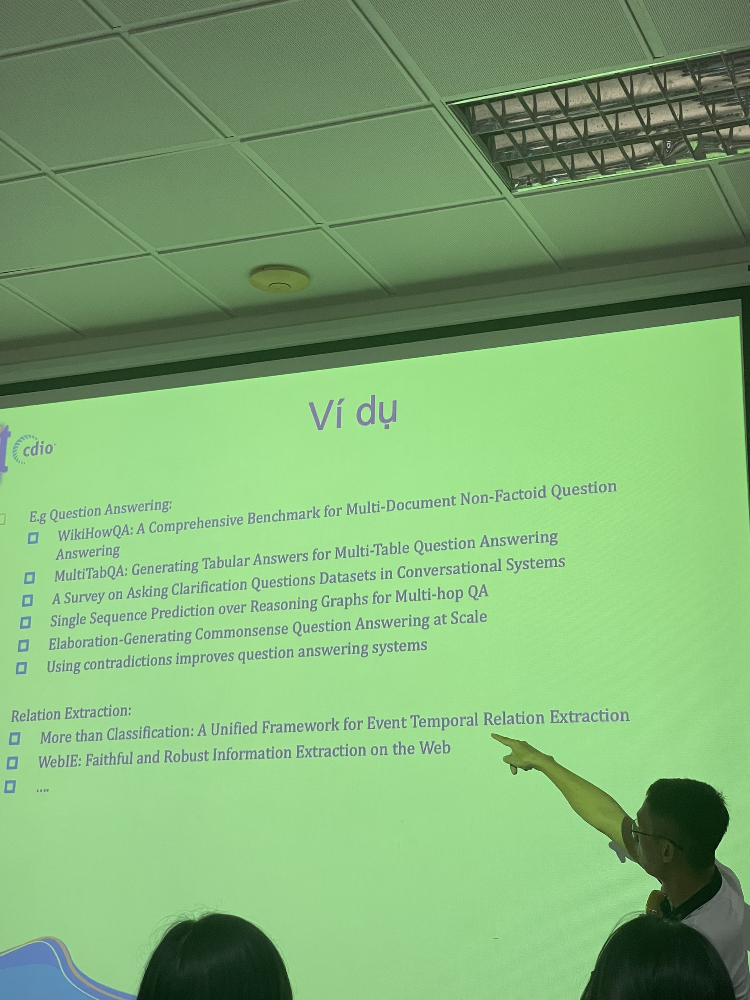
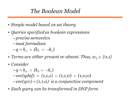

# Khai thác ngữ liệu văn bản

## 20/07/2023
### Giới thiệu - Tổng quan
Phân loại dữ liệu:
- Có cấu trúc (structured data): thông tin đã chọn lọc và lưu dưới dạng cấu trúc
    - có thể thể hiện dạng rational database
    - sẵn sàng để khai thác
    - có thể dùng các thuật toán data mining
- Không có cấu trúc (unstructured data): thông tin trình bày dạng tự nhiên, không theo chuẩn mực, định dạng không nhất quán
    - không thể thể hiện dạng rational database
    - chưa sẵn sàng để khai thác
    - ví dụ: các comment trên một trang web, các dữ liệu đa phương tiện (image, video, audio, file, emails,spreadsheets..)

Dữ liệu văn bản:
- hình thức trao đổi phổ biến nhất
- đặc điểm: không có cấu trúc trình bày cụ thể
- làm thế nào để khai thác thông tin hữu ích trong lượng dữ liệu khổng lồ này? $\rightarrow$ khai thác văn bản = text-mining/text-analytics

Khai thác văn bản:
- quá trình phát hiện tri thức ẩn trong văn bản
- không phải là khai thác dữ liệu (phát hiện tri thức có cấu trúc)
- đây là bước trước bước khai thác dữ liệu

Ứng dụng của khai thác văn bản
- sentiment analysis / opinion mining
- early warning outbreak / outbreak detection (phát hiện sớm dịch bệnh)
- social listening
    - đo lường sức khoẻ thương hiệu
    - xử lý khủng hoảng truyền thông
    - thăm dò đối thủ cạnh tranh
- fake news detection
- fraud detection
- chatbot & 

Kiến trúc chung của một hệ thống khai thác văn bản:

Phân loại các bài toán của hệ thống khai thác văn bản
- phân lớp văn bản (text category/document classification)
    - phân loại một văn bản vào một hay một vài loại cho 
- information extraction
    - xác định/rút trích các thành phần quan tâm trong văn bản
    - chuyển từ dạng không có cấu trúc sang dạng có cấu trúc
    - các bài toán đặc trưng (cấp độ):
        - named entity extraction: tên người, địa điểm, tên tổ chức, tên sản phẩm, tên thương hiệu...
        - relation extraction (các sự kiện, tìm các thực thể và quan hệ giữa chúng)
    - ứng dụng: trending analysis, social listening...
- document clustering
    - tự động chia tập hợp các văn bản thành các nhóm
- information retrieval
    - chọn lọc thông tin liên quan trước khi thực hiện các kỹ thuật mining
    - phương pháp cơ bản: so sánh sự tương đồng giữa nội dung tài liệu và câu truy vấn
    - cần 2 mô hình:
        - lưu trữ tài liệu
        - tính độ tương đồng
    - ứng dụng: search engines
- ...
- hoặc là sự kết hợp của một số bài toán này

Các cách tiếp cận cho bài toán khai thác văn bản:
- phương pháp sử dụng luật/heuristics (rule-based methods)
    - dùng if-else, regex, heuristics
    - rút trích tên riêng (tên đi sau chữ "ông/bà")
    - ưu: đơn giản
    - khuyết:
        - tốn công/khó xây dựng bộ luật
- phương pháp học máy: hệ thống tự động học cách giải quyết bài toán
    - học máy có giám sát
    - học máy không giám sát
- phương pháp "prompt engineering: sử dụng mô hình ngôn ngữ lớn (LLM)

Học máy có giám sát, gồm 2 giai đoạn
- huấn luyện mô hình
- sử dụng mô hình để dự đoán dữ liệu mới

Các bước giải quyết bài toán khai thác văn bản:
- chia nhỏ bài toán
- giải quyết các bài toán nhỏ
- có thể kết hơp các phương pháp để giải quyết các bài toán nhỏ
- tổng hợp để có được giải pháp cho bài toán 

Các bước cho các bài toán nhỏ:
- xác định nguồn dữ liệu
- tiền xử lí dữ liệu
- gắn nhãn dữ liệu
- xây dựng mô hình
- kiểm thử / đánh giá
- tinh chỉnh mô hình
- triển khai

### Mục tiêu môn học

https://2023.aclweb.org/program/best_papers/

https://underline.io/events/284/sessions?eventSessionId=10659

https://2021.emnlp.org/papers

https://aclanthology.org/events/emnlp-2022

## 030823
## Rút trích thông tin văn bản (Information extraction)

Các bài toán đặc trưng
- nhận diện thực thể định danh: NER
- 
    - event extraction

Mục tiêu
- annotate (gắn nhãn tài liệu)
- tại sao lại cần chuyển từ html sang xml?

Công nghệ 
- lexicon lookups: tìm kiếm một thuật ngữ có trong từ điển hay không

Quy trình xây dựng kho dữ liệu tri thức

cần lưu dữ liệu về knowledge DB và dùng từ đây để chạy các thuật toán học máy -> hi vọng chạy ổn định hơn =))

Một số ứng dụng
- map skills giữa JD và CV =))

Landscape for IE Tasks:
1.
2. 
3. Complexity
- rút trích thông tin dạng closed set (trong hữu hạn )
- regular set (vô hạn có format =))), ví dụ số điện thoại (biết dc có nhiu số :'>)
- complex pattern ()
- ambiguous pattern (không có format cụ thể) => khó, ví dụ tên riêng
4. single field vs record
- 

Các mô hình sử dụng trong IE
- Lexicons: lướt qua văn bản, kiểm tra đối tượng đang xét có trong tập từ điển khum
- classify pre-segmented candidates: xác định term đang xét thuộc lớp nào 
- sliding window: y chang trên mà dùng cửa số trượt =))
- boundary models: chạy hai vòng lặp, một tìm nơi bắt đầu, một tìm nơi kết thúc 
- finite state machines
- context free grammars

regular expressions
- input: các mẫu đã được gán nhãn thủ công
- thường dùng cho số, date, email, tên người có đi kèm chức danh (Dr. Abc)

Sequence labeling: gắn nhãn từng token thuộc về một **loại đặc biệt** thể hiện cho loại đối tượng
- dùng IOB annotation trong đó I-inside, O-outside, B-begin, gán trên từng token
- giới thiệu IOB annotation/CONLL format, [CoNLL-U](https://universaldependencies.org/format.html) 
- có thể đoán ra những token ngay cả khi không có trong từ điển train do đã học được pattern

Relation extraction methods
- manually engineered rules: 
    - rules based on words/entities/parsed text: ví dụ <company> located in <location>
- weakly supervised relation extraction (semi-supervised)
    - giả sử có rule: <company> located in <location>
    - sau khi tìm dc, ta duyệt cả văn bản tìm các từ giữa company và location còn lại -> tạo rule mới và tiếp tục

[CoNLL2003](https://huggingface.co/datasets/conll2003)

Lab03: làm NER cho tiếng việtt

## 100823
## Thu thập, tiền xử lý và biểu diễn văn bản

Thu thập dữ liệu

1. Xác định bài toán để chọn cách giải:
    - Phân loại: có số lượng và nhãn loại trước
    - Sequence-to-sequence: input và output đều là sequence nhưng không nhất thiết cùng kích thước. Ví dụ, tóm tắt một văn bản cho trước, chatgpt
    - gom nhóm: không xác định trước nhãn loại như bài toán phân loại

2. Thu thập dữ liệu ứng với phương pháp giải:
    - thu thập tự động (crawler + gắn nhãn tự động)
    - bán tự động (crawler + gắn nhãn tay)
    - tự tạo dữ liệu
    - few-shot-learning?

Xử lý dữ liệu
- làm sạch dữ liệu: upper/low-case, nếu ngữ nghĩa như nhau thì nên biểu diễn dưới 1 hình thức nhất định
- xử lí dữ liệu bị thiếu
- đánh giá các yếu tố về cân bằng dữ liệu: 
    - từ lạ, chỉ xuất hiện rất ít lần trong một văn bản -> nên bỏ hay không =))
    - các từ dùng quá thường xuyên nhưng không mang nội dung chính mà máy cần học
- code-switch, trường hợp lẫn lộn các thứ tiếng trong cùng một văn bản

Biểu diễn dữ liệu
- chuyển văn bản có độ dài khác nhau về một dạng dữ liệu có kích thước cố định (thông thường là vector có cùng chiều dài)

Một số cách biểu diễn:
- TF-IDF: 

    - TF: tần số xuất hiện của các từ trong một câu
    - IDF: đánh trọng số thấp cho các từ xuất hiện trong nhiều câu và ngược lại do ta cần phân biệt các câu với nhau
    - Hạn chế: 
        - kích thước vector tỉ lệ thuận với độ lớn của từ điển -> vector thưa
        - không thể hiện được thứ tự từ -> dùng n-gram: khắc phục hạn chế thứ tự từ của các phương pháp trước đó -> vector thưa hơn nữa =))

- Word-embedding: học cách thiết kế cái nì :'>

## Backpropagation and Neural Networks

Giới thiệu perceptron 
- hàm activation: đưa giá trị tổng W.X về một đoạn xác định (một cách chuẩn hoá), chuyển kết quả vừa tính từ tuyến tính sang phi tuyến?
- w_0 ~ bias giúp hàm linh hoạt hơn ??

Một số thuật toán tìm bộ trọng số W như:
- SGD
- Adam

Cost function (tuỳ bài toán sẽ có hàm loss khác nhau):
- Cross entropy, thường dùng cho bài toán phân loại 
- MAF
- MSE

Gradient descent - cho biết xu hướng biến thiên của hàm theo biến đang xét

Learning rate - scheduling learning rate: quyết định tốc độ học của mô hình, tránh trường hợp hàm loss không thể hoặc hội tụ chậm

## 170823
## SentimentAnalysis

Pre-condition: Tách văn bản thành từng từ: dùng keras - text_to_word_sequcece

Cách 1: (làm baseline) văn bản có từ positive thì khen, không thì là chê =)) --> không tính đến các trường hợp như: phủ định, văn bản có hướng negative mặt dùng có môt số từ positive

Cách 2: tf_idf loại bỏ bớt các từ lặp lại nhiều lần

Cách 3: dùng vectorizer --> svm 

### word embeddings = word vector 

Biểu diễn các từ thể hiện được việc chúng có ngữ nghĩa gần nhau hay không bằng các word vector (thường từ 300 đến 500, nhiều lắm là 700)

là ma trận trọng số với kích-thước-vector-biểu-diễn-từ x ma-trận-trọng-số (ví dụ: (1x17) x (17x300))- về bản chất khá giống mạng dense/fully-connected
Có 2 cách chính:
- thiết kế tay model (alore)
- dùng mạng neural để học

Word2Vec

Đánh giá một câu sinh ra bởi mô hình có tự nhiên, có trong thực tế hay không bằng xác suất xuất hiện trong thực tế dùng ppl complexity

LLM --> human feedback (đánh giá câu sinh ra có hợp lý khum và điều chỉnh lại model -- thay cho ppl trước đây)

glue benchmark -- superGLUE

Two model variants
- skip-grams
- continueous bag of words (CBOW)

Word2Vec của google
FastText của Facebook -- có tiếng Việt

Do thiếu ngữ cảnh để phân biệt đồng âm khác nghĩa (ví dụ bank ngân hàng và bank bờ sông) --> 

Về thử 
- sử dụng các dạng pre-train embedding (word2vec) khác nhau và đánh giá chúng
- chạy 3 cách: convoluntion (cnn), lstm (rnn), lấy trung bình (average vector) -> cái nào ra kết quả tốt hơn

## 240823
## Attention - Transformer - BERT

Giới thiệu Multi-channel LSTM-CNN

Giới thiệu Encoder - Decoder dùng LSTM cho dạng sequence-to-sequence

Giới thiệu Attention: hành vi nhận thức để lựa chọn tập trung vào cái gì và bỏ qua cái gì

Attention in text: huấn luyện để biết mỗi một câu nên chú ý keyword nào

Giới thiệu Attention in NLP
- Additive attention là gì

Giới thiệu Attention in Transformer:
- Query: 
- Key
- Value
- Multi-Head Attention: số lần dùng mạng dense ở bước linear

Giới thiệu Transformer
- Positional Encoding: giúp thể hiện thứ tự từ do transformer nguyên thuỷ ko thể hiện điều này

Giới thiệu BERT
- CLS trong BERT
- Pre-train language model
- Masked language modeling: 
    - dự đoán từ bị che (điền vào chỗ trống) -> cao xa hơn thằng dự đoán tự tiếp theo :'>
    - dự đoán câu tiếp theo

Giới thiệu T5 (một thằng kế trước thằng chatgpt):
input=prompt => output=answer

Giới thiệu chatgpt
Pre-train LM => [prompt] --(LM)--> [answer] --(model Preferrence*)--> trả ra điểm [0,10] --> cập nhật LM

* model cần trainning

Các bước train chatgpt (LM và preferrence)
- B1: train rất nhiều LM để từ 1 prompt tạo nhiều answer
- B2: để người đánh giá (reinforcement human feedback) -> bộ data ứng với prompt và answer đi kèm điểm
- B3: lấy data vừa tạo làm mồi để train model Preference
- B4: HF -> RLHF (AI feedback đồ :'>), người đưa ra prompt -> LM tạo nhiều answer -> dùng chatgpt để chọn lại kết quả tốt nhất :'> => tránh model học điều xấu

# Theory Final Project:
- Paper: What the DAAM: Interpreting Stable Diffusion Using Cross Attention
- Link paper: https://arxiv.org/pdf/2210.04885.pdf
- Github: https://github.com/castorini/daam

- Sử dụng DAAM để trích xuất các thuộc tính trong các ảnh làm dữ liệu đầu vào các thuộc tính
- Tạo caption cho ảnh không cần phải input thuộc tính như các phương pháp truyền thống

## 070923
## Tìm kiếm thông tin (Information Retrieval)

So sánh IR vs. database

Ứng dụng IR - kiến trúc phổ biến: IR-based question answering

- bước  1: phân tích câu hỏi người dùng
    - phân loại câu hỏi
    - nhận diện thực thể trong câu hỏi
    - mở rộng câu truy vấn
- bước 2: tìm kiếm IR
    - tìm câu/đoạn/tài liệu có thể chứa câu trả lời
- bước 3: tìm câu trả lời

Giới thiệu Web Search Process

Matching in IR

Chọn từ khoá 
- Phương pháp đơn giản: chọn từ có tần suất ở giữa 

Chọn trọng số - Phương pháp trọng số: tf*idf
- TF: 
    - tần suất xuất hiện term trong tài liệu

Tập tin nghịch đảo (inverted file)
do term là hữu hạn nên việc tìm kiếm bằng inverted file có thể giúp tăng hiệu năng từ đó tìm kíêm nhanh hơn. Khi người dùng hỏi europe chẳng hạn, ta nhắm mắt trả về docID là 1, 2, 7 trong index lun

matching score in IR

boolean model: tìm tài liệu theo biểu thức logic

tài liệu D = biểu thức logic "and" của các từ khoá. Ví dụ: D = t1 and t2 and t3 and ... tn

Câu truy vấn Q = biểu thức Bool của các từ khoá. ví dụ Q = t1 or (t2 and not t3)

Giới thiệu BM25 - ranking kết quả theo điểm dựa vào TF và IDF

Đánh giá độ chính xác của IR dựa trên recall và 

đồ thị 11 điểm thể hiện độ chính xác trung bình

độ đo xếp hạng - MAP (Mean Average Precision)

- tử là index j
- mẫu là vị trí kết quả đúng trả về của từng hệ thống

F-score: đánh trọng số recal, trong đó recal sẽ quan trong hơn precision $\beta$ lần

Giới thiệu [Download ElasticSearch](https://github.com/elastic/elasticsearch)

link tài liệu của thầy: https://drive.google.com/drive/folders/1X37iHqqMkMrv_BrYq0oMJWoHyY7gp9y8

# Lịch nộp và báo cáo đồ án

Seminar: 5-7/10

Đồ án thực hành: 17-18/10

- Nộp report, demo, source code, (slide+clip)??

## 210923
## Mô hình ngôn ngữ lớn cho văn bản và chatbot (LLM for texts and chatbots)

[Survey of LLM](https://arxiv.org/pdf/2303.18223v12.pdf)

Xây dựng chatbot FQA dùng LLM với dữ liệu của doanh nghiệp

[Introducing Accelerated PyTorch Training on Mac](https://pytorch.org/blog/introducing-accelerated-pytorch-training-on-mac/)
[Locally](https://pytorch.org/get-started/locally/)